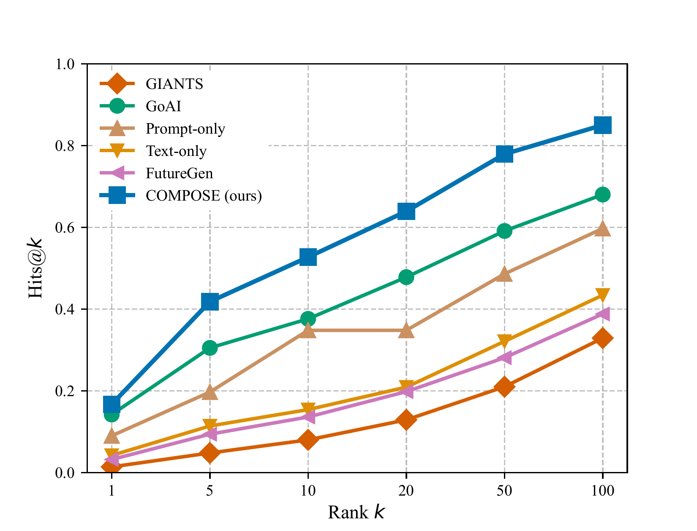

# COMPOSE: Composing Future Theorems from Citations and Formal Structure

**David Busbib, Michael Werman** · Hebrew University of Jerusalem

[](https://arxiv.org/abs/2605.30333)
[](https://david-busbib.github.io/COMPOSE-page/)
[](https://huggingface.co/TheNisso/compose-checkpoint)
[](LICENSE)

---

Given a mathematics paper on arXiv, COMPOSE generates a predicted future mathematical claim by jointly encoding its citation graph and its formal Mathlib4 theorem dependencies. A dual-graph GNN encoder fuses both signals via bidirectional cross-attention and conditions a DeepSeek-Math-7B decoder to produce the prediction.

## Requirements

- Python ≥ 3.10, CUDA 12.x, 80 GB VRAM (tested on H200 and L40S)
- Disk: ~40 GB total (35 GB checkpoint + 3 GB Mathlib + 1.3 GB E5-large-v2 auto-downloaded on first run)
- Internet required on first run for HuggingFace model downloads

## Quickstart

```bash
git clone https://github.com/david-busbib/COMPOSE && cd COMPOSE
pip install -r requirements.txt
bash scripts/download_checkpoint.sh        # ~35 GB  (model weights)
bash scripts/download_mathlib.sh           # ~3 GB   (Mathlib corpus for enc2)

python3 code/run_on_paper.py --arxiv_id 1911.06307
```

## What `run_on_paper.py` does

Given only an arXiv ID, the script:

1. **Fetches the paper and all its references** from the Semantic Scholar public API (no API key needed)
2. **Embeds each reference abstract** with E5-large-v2 and builds the citation subgraph (enc1 input)
3. **Matches the paper's informal theorems to Mathlib4** using embedding similarity, then builds the formal theorem dependency subgraph (enc2 input)
4. **Runs the dual-graph encoder** — enc1 (citation GNN) and enc2 (Mathlib GNN) fuse via bidirectional cross-attention
5. **Decodes with DeepSeek-Math-7B** conditioned on the fused graph representations
6. **Outputs `--n` predicted future claims** in plain text

No training data or API keys are needed. E5-large-v2 (~1.3 GB) is downloaded automatically from HuggingFace on the first run.

> **Without `download_mathlib.sh`:** enc2 is skipped and the model runs on the citation graph only (enc1-only mode). Predictions will be weaker.

**Options:**
```
--arxiv_id 2301.07041     arXiv paper ID
--n 3                     number of predictions to generate (default: 3)
--max_new_tokens 250      max tokens per prediction
--checkpoint /path/to/best_model.pt
```

**Example** (arXiv:1911.06307, "Symbolic power containments in singular rings in positive characteristic"):
```
INFO Fetching arXiv:1911.06307 from Semantic Scholar...
INFO   Title: Symbolic power containments in singular rings in positive characteristic
INFO   References with abstracts: 24
INFO Loading Mathlib corpus embeddings...
INFO   Mode: full COMPOSE (enc1 citation graph + enc2 Mathlib theorem graph)
INFO Building DualEncoderModel...
INFO Loading checkpoint: checkpoints/best_model.pt
INFO   epoch=40, val_loss=1.1245

======================================================================
COMPOSE predictions for arXiv:1911.06307  [enc1 + enc2]
  Symbolic power containments in singular rings in positive characteristic
======================================================================

[1]
In arbitrary commutative regular Poisson algebras with constant unit there is a
strong link between ideals and primitive elements: an ideal becomes equal to its
intersection with another important substructure -- the set of doubly prime
primitives (elements whose square lies in any given proper subspace). This
connection was previously exploited for studying Lie superalgebras arising as
degenerations of type A Nicholsian envelopes; here we extend it beyond this
class by looking at wider classes including those coming from degenerate
contraction schemes on symmetric spaces associated to certain reductive subgroups.

[2]
In contrast to earlier work on symbolic powers over fields of finite and tame
type characteristics, we study maximal orders (rings without zero divisors) that
are not isomorphic as $\mathbb{Z}$-modules when $p>0$ is an arbitrary prime
greater than or equal to three. This provides a new example showing that there
exist noncommutative graded Lie algebras whose associated ideals have no
corresponding bases (see also [BGSV2]). The second author proves related results
regarding existence/uniqueness questions concerning root systems arising from
automorphism groups.

[3]
In previous work \cite{LR1}, we described the Gale dual of a toric degeneration
as an open subvariety inside another natural compactification -- the extended
cone -- of certain Richardson varieties (or complete intersections). This allowed
us to give equations for various geometric invariants such as degree and Milnor
number under torus actions on del Pezzo surfaces.
======================================================================
```

## Architecture

```
Citation subgraph              Mathlib theorem subgraph
  [N × 1024] E5                  [M × 1024] E5
      ↓ SimpleGNN                    ↓ SimpleGNN
  [N × 1152]                     [M × 1152]
      ↓ Bridge MLP                   ↓ Bridge MLP
  [N × 4224]  ←─ bidirectional cross-attention ─→  [M × 4224]
                              ↓
                  DeepSeek-Math-7B decoder
              (cross-attention at layers 3,7,11,15,19,23,27,31)
                              ↓
                    Generated future claim (text)
```

Only cross-attention weights are trained (10.7% of parameters).

## Results

To evaluate, generated claims are embedded with E5-large-v2 and used to rank a pool of 47K real future papers by cosine similarity (H@k, MRR). The pool and ground-truth labels are eval-only — the model itself only generates text.

**Main evaluation (full test set, 47K pool):**

| Model | H@10 | H@100 | Gap |
|---|---|---|---|
| **COMPOSE (ours)** | **0.508** | **0.808** | **0.240** |
| CoI-GPT4 | 0.410 | 0.770 | 0.176 |
| Text-only (LoRA) | 0.369 | 0.738 | 0.177 |
| Prompt-only | 0.348 | 0.697 | 0.211 |
| GoAI | 0.376 | 0.680 | 0.202 |
| Fixed NN | 0.068 | 0.392 | 0.108 |
| GIANTS | 0.080 | 0.329 | 0.207 |



**Ablations (confidence-stratified 200-sample subset, 47K pool):**

| Model | H@10 | H@100 | Gap |
|---|---|---|---|
| **Full graph (ours)** | **0.750** | **0.845** | **0.201** |
| Formal-graph only | 0.510 | 0.810 | 0.141 |
| w/o stage-1 pretraining | 0.240 | 0.505 | 0.093 |
| w/o fusion | 0.195 | 0.530 | 0.090 |
| Paper-graph only | 0.075 | 0.260 | 0.043 |

Gap = Tgt-Sim − Neg-Sim (cosine to target minus cosine to 500 random negatives).

## Evaluation

```bash
export COMPOSE_DATA_DIR=/path/to/data
export COMPOSE_CKPT_DIR=/path/to/checkpoints
sbatch scripts/eval.sh
```

Computes H@k, MRR, BERTScore, and retrieval rank distributions. Results saved as JSON under `code/baselines/metrics/`.

Other model variants:
```bash
python3 code/baselines/metrics/eval_future.py --model paper_graph_only --checkpoint ...
python3 code/baselines/metrics/eval_future.py --model text_only --checkpoint ...
python3 code/baselines/metrics/eval_future.py --model retrieval
python3 code/baselines/metrics/eval_future.py --model goai
```

## Training

```bash
sbatch scripts/train.sh
```

Uses `COMPOSE_DATA_DIR`, `COMPOSE_CKPT_DIR`, `ENC1_CKPT`, `ENC2_CKPT` environment variables. See `code/train_dual.py` for all hyperparameters.

## Data

Training data is not publicly released due to copyright restrictions on the underlying arXiv and Semantic Scholar content.

## Code Layout

```
code/
├── model_clean.py              # paper-graph encoder + decoder
├── model_clean_theorem.py      # theorem-graph encoder (enc2)
├── cross_attention_layers.py   # bidirectional fusion
├── train_dual.py               # training loop (InfoNCE + CE)
├── build_paper_theorem_embs.py # step 1: embed paper theorems
├── build_mathlib_graphs.py     # step 2: build Mathlib subgraphs
├── build_dataset_v7.py         # step 3: assemble samples
└── baselines/
    ├── train_text_only.py
    ├── retrieval_baseline.py
    └── metrics/
        ├── eval_future.py
        └── compute_metrics.py
scripts/
├── train.sh / eval.sh
├── download_checkpoint.sh
└── ablation_*.sh
```

## Citation

```bibtex
@article{busbib2026compose,
  title={{COMPOSE}: Composing Future Theorems from Citations and Formal Structure},
  author={Busbib, David and Werman, Michael},
  journal={arXiv preprint arXiv:2605.30333},
  year={2026}
}
```
